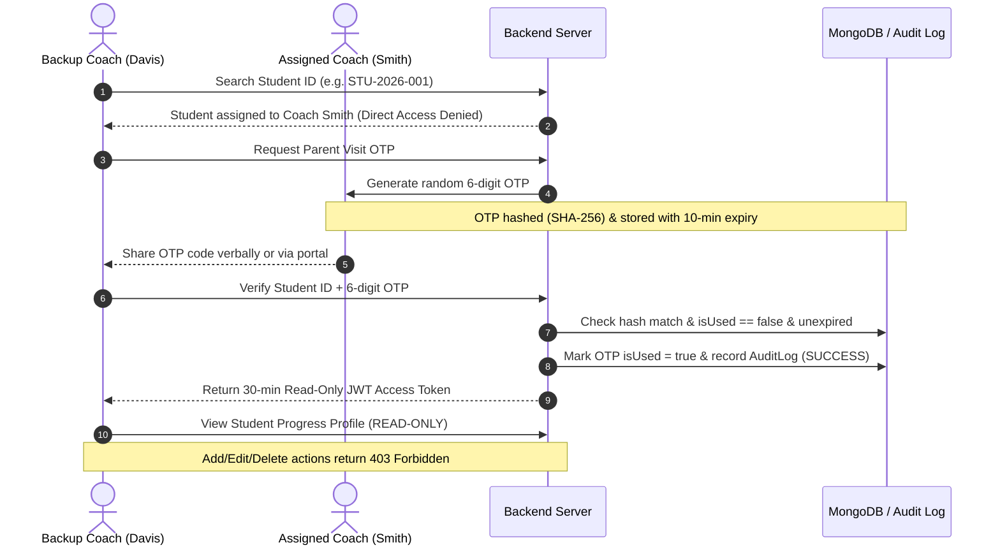

# Success Coach Interaction & Student Progress Tracking System

Full-stack college management system for tracking student interactions, academic & behavioural progress, and facilitating authorized backup Success Coach access during parent visits using secure, single-use OTPs.

---

## 📌 Problem & Solution Overview

In colleges, a **Success Coach** is assigned to approximately two classes and maintains deep knowledge of the progress, behavior, academic development, and personal interactions of their assigned students.

### The Challenge
When a primary Success Coach is absent or on leave and a student's parent visits the college, another Success Coach cannot easily access the student's progress history. This creates communication delays, particularly for parents traveling long distances.

### The Solution
This web application securely stores student-success-coach interaction records and introduces an **Authorized Backup Coach Access System**. When an assigned coach is absent, a backup coach can request and enter a **single-use 10-minute OTP** generated by the assigned coach to gain **temporary 30-minute read-only access** to the student's progress profile. Every access attempt is logged in system audit trails.

---

## 🔑 Main Roles & Capabilities

### 1. Admin
- **Class & Coach Management**: Create classes, assign primary Success Coaches to classes and student cohorts.
- **User Administration**: Add/edit Success Coaches and Students.
- **System Audit Logs**: Inspect system-wide security logs, login events, OTP generations, and profile accesses.

### 2. Success Coach
- **Workspace Dashboard**: View total assigned students, today's session count, pending follow-ups, and parent visit activity.
- **Instant Student Search**: Search any college student by unique `CollegeStudentId`.
- **Student Progress Profile**: View basic info, parent contacts, academic status, attendance percentage, and chronological interaction history timeline.
- **Add Interaction**: Record session type (Academic, Behavioural, Attendance, Career, Personal, Parent Meeting), academic progress, behavior notes, attendance observations, topics discussed, coach remarks, and follow-up deadlines.
- **Parent Visit / Backup Access (OTP)**: Generate 6-digit OTPs or enter Student ID + OTP to unlock 30-minute read-only access for absent coaches' students.

### 3. Student
- **Student Portal**: View personal profile, assigned Success Coach details, overall academic status, attendance rating, permitted interaction history, and follow-up action items.

---

## 🔒 Security & OTP Verification Workflow



- **Single-Use Enforcement**: Immediately invalidated (`isUsed = true`) upon verification.
- **Time-bound Expiration**: Automatically expires after 10 minutes.
- **Secure Hashing**: Stored as SHA-256 HMAC hash in database; plain text is never persisted.
- **Strict Read-Only Enforcement**: Temporary access tokens permit `GET` requests for student profile viewing, but block `POST`, `PUT`, `DELETE` operations.
- **Audit Logging**: Every access attempt (success, failed code, expired attempt, or reuse attempt) is recorded in system audit logs with timestamp and IP address.

---

## 🛠️ Tech Stack

### Frontend
- **Framework**: React 18 + TypeScript + Vite
- **Styling**: Tailwind CSS + Custom CSS Design Tokens
- **Icons**: Lucide React
- **Routing**: React Router DOM v6
- **HTTP Client**: Axios with Authorization Bearer Interceptors

### Backend
- **Runtime**: Node.js + Express.js + TypeScript
- **Database**: MongoDB (via Mongoose ODM) with automated `mongodb-memory-server` fallback for zero-configuration out-of-the-box local execution.
- **Authentication**: JSON Web Tokens (JWT) + bcryptjs password hashing.
- **OTP Hashing**: Node.js Crypto (SHA-256 HMAC).

---

## 📁 Folder Structure

```
success-coach-system/
├── backend/
│   ├── src/
│   │   ├── config/          # MongoDB connection & fallback setup
│   │   ├── controllers/     # Auth, Admin, Coach, Interaction, OTP, Student controllers
│   │   ├── middleware/      # JWT Protect, Role Authorize, Student Access & Audit Loggers
│   │   ├── models/          # User, Class, Student, Interaction, OtpRequest, AuditLog
│   │   ├── routes/          # Express REST API route definitions
│   │   ├── utils/           # OTP Generator (SHA-256) & Seed Data
│   │   ├── seed.ts          # Automated Database Seeder
│   │   └── server.ts        # Main Express server entry point
│   ├── package.json
│   ├── tsconfig.json
│   ├── .env
│   └── .env.example
├── frontend/
│   ├── src/
│   │   ├── components/      # Navbar, Sidebar, StatCard, Modal, Toast, AddInteractionModal, OtpModal
│   │   ├── context/         # AuthContext provider with Quick Role Switcher
│   │   ├── pages/           # Login, AdminDashboard, CoachDashboard, StudentDashboard, StudentProfile, AuditLogs, ClassesPage
│   │   ├── services/        # Axios API client
│   │   ├── types/           # TypeScript interfaces
│   │   ├── App.tsx          # Main React router app layout
│   │   ├── main.tsx         # Entry file
│   │   └── index.css        # Tailwind directives & glassmorphism styles
│   ├── package.json
│   ├── vite.config.ts
│   ├── tailwind.config.js
│   └── index.html
├── .env.example
└── README.md
```

---

## 🚀 How to Run Locally

### Prerequisites
- Node.js (v18+)
- npm (v9+)

### 1. Backend Setup
```bash
cd backend
npm install
npm run seed     # Populate database with demo accounts & session logs
npm run dev      # Starts backend server on http://localhost:5000
```
> *Note: If a local MongoDB instance is not running, the backend automatically launches an in-memory MongoDB instance using `mongodb-memory-server` for seamless execution.*

### 2. Frontend Setup
```bash
# In a separate terminal tab:
cd frontend
npm install
npm run dev      # Starts Vite React dev server on http://localhost:5173
```

Open [http://localhost:5173](http://localhost:5173) in your browser.

---

## 🧪 Demo Test Accounts

For quick evaluation, click any of the **Quick Demo Login buttons** in the top navigation bar or log in with the following credentials:

| Role | Name & Details | Email / Identifier | Password |
| :--- | :--- | :--- | :--- |
| **Admin** | College Dean Administration | `admin@college.edu` | `admin123` |
| **Success Coach (Primary Sec A)** | Dr. Robert Smith | `coach.smith@college.edu` | `coach123` |
| **Success Coach (Backup Sec B)** | Prof. Sarah Davis | `coach.davis@college.edu` | `coach123` |
| **Student** | Alex Rivera (`STU-2026-001`) | `alex.rivera@student.college.edu` | `student123` |

---

## 📋 Major Workflow Testing Checklist

1. **Admin Login & Management**: Log in as `admin@college.edu` -> Manage classes, assign coaches, register students, view system security audit logs.
2. **Primary Coach Session Logging**: Log in as `coach.smith@college.edu` -> Open Alex Rivera (`STU-2026-001`) -> Click **Record Session Log** -> Save interaction with follow-up requirement.
3. **Backup Coach Parent Visit OTP Workflow**:
   - Log in as `coach.davis@college.edu` (Backup Coach).
   - Search Student ID `STU-2026-001`.
   - System prompts: *"Primary Coach is Dr. Robert Smith - Request OTP Access"*.
   - Click **Request OTP Access** -> Generate 6-digit OTP (e.g. `849201`).
   - Switch to **Enter & Verify OTP** -> Enter `STU-2026-001` + `849201`.
   - Click **Verify OTP & Unlock Access** -> Grants 30-minute read-only profile access!
   - Observe **Temp Read-Only Access Active** banner -> Attempting to record session log is blocked.
4. **Student Portal**: Log in as `alex.rivera@student.college.edu` -> View own profile, assigned coach contact info, attendance bar, and session logs timeline.
